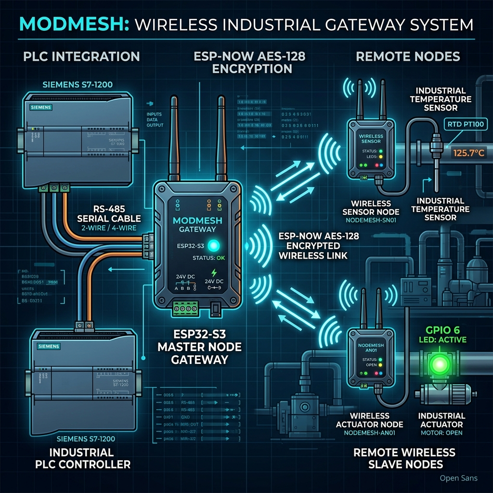
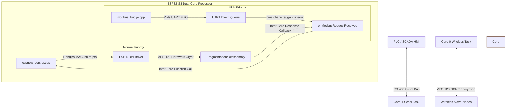
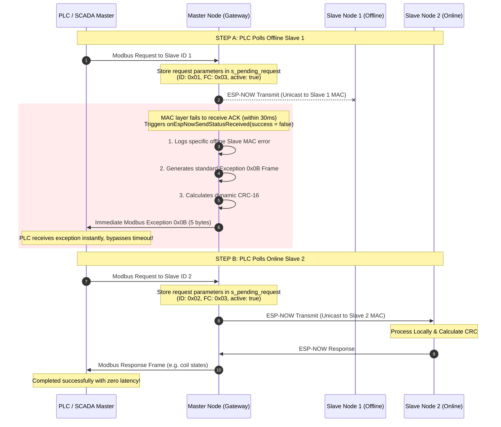
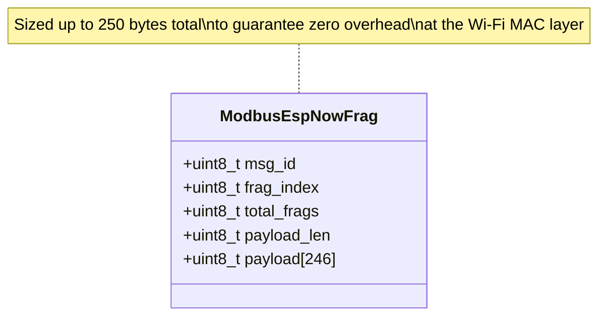

# ModMesh: Encrypted Modbus RTU Master Node


## 📌 1. Introduction & Industrial Use Case

The **ModMesh Master Node** is a high-performance, secure, and transparent **Encrypted Modbus RTU to ESP-NOW Wireless Bridge Router**. 

In modern industrial automation, wiring sensors and actuators across long distances or rotating machinery is highly expensive, fragile, and labor-intensive. Standard Modbus RTU relies on physical RS-485 differential serial cabling. 

The **ModMesh** ecosystem eliminates the cabling requirement by replacing physical copper wires with a **secure, hardware-encrypted, low-latency ESP-NOW wireless network**. 

### 🔄 The Master Node's Role
The **Master Node** acts as the core gateway router:
1. It physically connects to an Industrial Control System (such as a **PLC** or **SCADA HMI**) via an **RS-485 serial bus** using Modbus RTU.
2. It acts as a transparent router: when the PLC polls a specific Slave ID (e.g. `1` or `2`), the Master Node captures the request, encrypts it, and beams it over the air via **ESP-NOW** directly to the correct wireless slave node.
3. Upon receiving the wireless response, it decrypts it and writes it back onto the physical RS-485 serial line, completely transparent to the PLC.



---

## 🏗️ 2. Industrial Dual-Core Architecture

To meet strict industrial timing constraints and prevent network communication overhead from blocking critical real-time serial buses, the Master Node utilizes the **ESP32-S3's dual-core processor** in a strictly isolated **RTOS Task Model**:



### 📊 Thread & Core Allocation

| Core | Component / Task | RTOS Priority | Responsibility |
| :---: | :--- | :---: | :--- |
| **Core 1** | `modbus_bridge` | **10 (High)** | **Real-Time RS-485 UART**. Runs an isolated FreeRTOS polling task that monitors the UART FIFO. Uses a strict **5ms character-gap timeout** (equivalent to 3.5 character times at 9600 baud) to perfectly frame incoming Modbus frames from the PLC and routes them immediately. |
| **Core 0** | `espnow_control` | **5 (Normal)** | **Encrypted Wireless Pipeline**. Handles hardware-level Wi-Fi MAC layer interrupts, CCMP AES-128 packet encryption/decryption, fragmentation of oversized packets (> 250 bytes), peer discovery, and TX status callbacks. |

---

## ⚡ 3. The Instant Exception Engine (Addressing the Polling Bottleneck)

### ⚠️ The Problem: Sequential Polling Timeout
Modbus RTU is strictly **half-duplex** and **master-slave**. The PLC (Master) sends a request, waits for a response, and only then proceeds to the next request. 

If a Slave Node is offline or powered off, any ESP-NOW transmission to its MAC address will fail. Without an exception engine, the Master Node remains silent. The PLC is forced to wait for its internal **serial timeout (typically 1–2 seconds)**. 

If multiple slaves are queried, a single offline node introduces a massive 1-2 second latency spike. This severely degrades the responsiveness of online nodes (e.g. an actuator LED on `SlaveNode2` lagging or failing to react in real-time).

### 🚀 The Solution: Instant Exception Response Frame
To bypass this bottleneck, the Master Node implements an **Asynchronous Transmission Tracking & Instant Exception Engine**:



1. **Transaction Tracking**: In `main.cpp`, a volatile structure `s_pending_request` tracks the active serial request's parameters:
   ```cpp
   struct PendingModbusRequest {
       volatile bool active;
       uint8_t slave_id;
       uint8_t function_code;
       uint8_t dest_mac[6];
   };
   ```
2. **Asynchronous Send Callback**: The `espnow_control` component registers a TX status callback (`onEspNowSendStatusReceived`). When a packet is transmitted, the Wi-Fi driver receives a hardware-level over-the-air ACK (or lack thereof) and triggers this callback in **~30ms**.
3. **Instant Exception Return**: If the transmission fails (`success == false`) and there is an active matching request:
   * **Explicit Offline Logging**: The Master Node immediately prints a highly visible serial error identifying the offline node:
     ```log
     E (1250) MasterNode: !!! Slave Node 1 (AC:A7:04:F4:03:EC) is OFFLINE / UNREACHABLE !!!
     W (1250) MasterNode: Immediately returning Modbus exception 0x0B (Gateway Target Device Failed to Respond) to PLC
     ```
   * **Exception Frame Generation**: It builds a compliant 5-byte Modbus RTU Exception Frame:
     * **Byte 0**: `Slave ID` (e.g., `0x01`)
     * **Byte 1**: `Function Code | 0x80` (indicates error response, e.g., `0x83` for FC `0x03`)
     * **Byte 2**: `Exception Code 0x0B` (**Gateway Target Device Failed to Respond**)
     * **Byte 3 & 4**: Little-Endian Modbus **CRC-16** (calculated dynamically via `modbus_crc16()`)
   * **Immediate RS-485 Write**: The Master immediately writes this 5-byte frame onto the RS-485 bus using `modbus_bridge_transmit()`.
   * **Bypassing Timeouts**: The PLC receives the exception in ~30ms, registers that the target device failed to respond, and instantly moves to poll the next active slave node (`SlaveNode2`) with **zero delay**.

---

## 🔐 4. Wireless Security & Custom Fragmentation

The Master Node acts as a secure air-gap for the industrial PLC network. 

### 🛡️ Hardware-Level AES-128 Encryption
All over-the-air ESP-NOW frames are encrypted using the ESP32-S3's hardware Wi-Fi cryptographic engine:
- **PMK (Primary Master Key)**: `ESPNOW_PMK` secures the connection handshake.
- **LMK (Local Master Key)**: `ESPNOW_LMK` provides unicast AES-128-CCMP frame encryption.
- **Protected Peer Whitelisting**: The Master Node explicitly binds to `SLAVE_NODE_1_MAC` and `SLAVE_NODE_2_MAC`. Unregistered or un-encrypted devices attempting to spoof the network are silently dropped by the MAC layer.

### 🧩 Custom Packet Fragmentation
ESP-NOW has a hard payload limit of **250 bytes**. To safely handle industrial Modbus frames up to **256 bytes** (e.g., block register writes), a custom fragmentation layer is implemented in `espnow_control.cpp`:



```cpp
#pragma pack(push, 1)
struct ModbusEspNowFrag {
    uint8_t msg_id;        // Unique message transaction ID
    uint8_t frag_index;    // 0-indexed fragment number
    uint8_t total_frags;   // Total chunks to reassemble
    uint8_t payload_len;   // Bytes in this chunk
    uint8_t payload[246];  // Maximum chunk payload
};
#pragma pack(pop)
```
- **Sender**: Chunks larger frames into blocks $\le$ 246 bytes, attaches headers, and transmits.
- **Receiver**: Buffers incoming fragments by matching the `msg_id`. Once `frag_index == total_frags`, the packet is reassembled, validated, and passed to the application.

---

## 🔌 5. Hardware Setup & Pinout Configurations

The Master Node is built on the **ESP32-S3 DevKit** platform.

```
       ┌────────────────────────────────────────────────────────┐
       │                       ESP32-S3                         │
       │                                                        │
       │  [GPIO 17] ──────► [DI]   MAX485   [A] ───► RS-485 (A)  │
       │  [GPIO 18] ◄────── [RO]   MODULE   [B] ───► RS-485 (B)  │
       │                           (Auto-Dir)                   │
       │                                                        │
       │  [GPIO  1] ◄────── [Smart Reset Button] ──────► GND    │
       │  [GPIO 48] ──────► [WS2812 DIN (RGB LED)]               │
       └────────────────────────────────────────────────────────┘
```

### 1. Pin Assignment Tables

| Pin Function | GPIO | ESP32-S3 Pin | Connection on MAX485 / Device |
| :--- | :---: | :---: | :--- |
| **MAX485 DI (TX)** | **GPIO 17** | Pin 17 | Driver Input (DI) |
| **MAX485 RO (RX)** | **GPIO 18** | Pin 18 | Receiver Output (RO) |
| **MAX485 RE/DE** | **N/A** | - | Not connected (Auto-Direction Module) |
| **Smart Reset Button** | **GPIO 1** | Pin 1 | Momentary Button connected to GND (Active Low) |
| **WS2812 DIN** | **GPIO 48**| Pin 48 | WS2812B NeoPixel Data Input (DIN) |

### 2. Smart Reset & pre-Wipe Blinking Logic
The Master Node features an intelligent reset button task (GPIO 1) with an **active warning feedback loop** before a wipe occurs:
- **Short Press (< 1s)**: Triggers a clean soft reboot (accompanied by a **Blue** LED flash).
- **Double Click**: Prints detailed runtime statistics to the Serial Terminal (e.g. Free Heap space, task allocations, etc., flashing **Purple**).
- **Hold $\ge$ 3s (Local Reset)**: Prepares to wipe local credentials.
- **Hold $\ge$ 6s (Network-Wide Reset)**: Broadcasts an secure, hardware-encrypted 8-byte application signature `[0xDE, 0xAD, 0xBE, 0xEF, 0xFA, 0xCE, 0x00, 0x01]` to both Slave Nodes, prompting them to reset their NVS partitions.
- **🚨 3-Second Pre-Wipe Warning Blinking**: Once a reset sequence is triggered, the node delays the physical erase for **3 seconds**, entering a rapid, high-visibility **Red/Off blinking pattern (50ms Red / 50ms Off) at 10Hz**. This ensures the operator has visual feedback that the wipe sequence has safely initialized before the NVS flash is actually cleared.

---

## 🚦 6. Color Spectrum Visual Feedback (WS2812 NeoPixel)

The Master Node incorporates a WS2812 NeoPixel to provide sub-50ms visual tracking of the data pipeline:

| Color | Mode / Pattern | State Name | Meaning |
| :---: | :--- | :--- | :--- |
| 🟢 | **Dim Solid Green** | `LED_STATE_IDLE` | Node is healthy, idle, and listening. |
| 🔴 | **Solid Red** | `LED_STATE_ERROR` | System failure (Wi-Fi, UART, or NVS initialization error). |
| 🔵 | **Quick Blue Flash** | `LED_STATE_MODBUS_RX` | Modbus request successfully received from PLC via RS-485. |
| 🟡 | **Quick Yellow Flash** | `LED_STATE_ESPNOW_TX` | Encrypted query successfully transmitted over ESP-NOW. |
| 🌐 | **Quick Cyan Flash** | `LED_STATE_ESPNOW_RX` | Decrypted response successfully received from Slave Node. |
| ⚪ | **Quick White Flash** | `LED_STATE_MODBUS_TX` | Modbus response successfully written back to the PLC. |
| 🟠 | **Solid Orange** | `LED_STATE_WARNING` | Reset button is currently held down ($\ge$ 1 second). |
| 🔴 | **Rapid Red Flash** | Local Reset Strobe | Reset button held $\ge$ 3s (ready to wipe locally on release). |
| 🔴⚪ | **Red / White Strobe**| Network Reset Strobe | Reset button held $\ge$ 6s (ready to wipe network on release). |
| 🔴🔴 | **10Hz Red/Off Blink** | Pre-Wipe Warning | Wiping NVS Flash in progress (lasts for exactly 3 seconds). |

---

## ⚙️ 7. Configuration (`shared_config.h`)

All core network configurations are managed centrally in `shared_config.h` across the workspace:

```cpp
#define ESPNOW_WIFI_CHANNEL 1                  // Low-latency pinned Wi-Fi channel
#define MODBUS_BAUD_RATE    9600               // Industrial standard baud rate
#define MODBUS_UART_PORT    1                  // ESP32 UART port selection

// Peer Hardware MAC Whitelist
static const uint8_t MASTER_NODE_MAC[6]  = {0x94, 0xA9, 0x90, 0x19, 0x6A, 0x1C};
static const uint8_t SLAVE_NODE_1_MAC[6] = {0xAC, 0xA7, 0x04, 0xF4, 0x03, 0xEC};
static const uint8_t SLAVE_NODE_2_MAC[6] = {0xAC, 0xA7, 0x04, 0xF3, 0xFD, 0x54};
```

---

## 🛠️ 8. Educational Log Analysis & Troubleshooting

Students can analyze the following serial logs under various conditions to understand the network's state:

### Case A: Normal Operation (Successful Poll of ID 2)
```log
I (1000) MasterNode: Master Node initialized and listening.
I (4200) MasterNode: PLC requested Slave ID 2 (len: 8)
I (4200) MODBUS_RX: 02 03 00 00 00 01 84 39                # Received Read Holding Reg from PLC
I (4205) espnow_control: Send status callback: successfully transmitted payload
I (4225) MasterNode: Received ESP-NOW response from Slave, routing to PLC (len: 7)...
I (4225) ESPNOW_RX: 02 03 02 00 01 5D 84                   # Received data response from Slave 2
I (4228) modbus_bridge: Successfully written 7 bytes back to PLC
```

### Case B: Handling an Offline Slave (ID 1 is Offline)
```log
I (1220) MasterNode: PLC requested Slave ID 1 (len: 8)
I (1220) MODBUS_RX: 01 03 00 00 00 01 84 0a                # PLC queries Slave 1
E (1250) espnow_control: Send to ac:a7:04:f4:03:ec failed   # ESP-NOW times out in ~30ms (no ACK)
E (1250) MasterNode: !!! Slave Node 1 (AC:A7:04:F4:03:EC) is OFFLINE / UNREACHABLE !!!
W (1250) MasterNode: Immediately returning Modbus exception 0x0B (Gateway Target Device Failed to Respond) to PLC
I (1252) MasterNode: Exception frame sent to PLC
I (1252) MODBUS_TX_EXCEPTION: 01 83 0B 81 33               # 5-byte Exception returned. PLC polls ID 2 immediately!
```

### Case C: Executing a Network Factory Reset
```log
W (6200) device_reset: Smart Reset Button held down for 6 seconds.
W (6210) device_reset: Network-Wide Reset Triggered!
I (6210) MasterNode: !!! BROADCASTING REMOTE FACTORY RESET TO ALL SLAVE NODES !!!
I (6225) espnow_control: Send to ac:a7:04:f4:03:ec successful
I (6240) espnow_control: Send to ac:a7:04:f3:fd:54 successful
E (6240) MasterNode: !!! FACTORY RESET PROCESS STARTED - BLINKING LED FOR 3 SECONDS !!!
# (Node blinks RED/OFF at 10Hz for 3000ms...)
E (9240) MasterNode: !!! WIPING NVS FLASH AND REBOOTING NOW !!!
```

---

*Developed by M. YOUCEF Yazid | v1.2.0 Master Node Production Edition*
