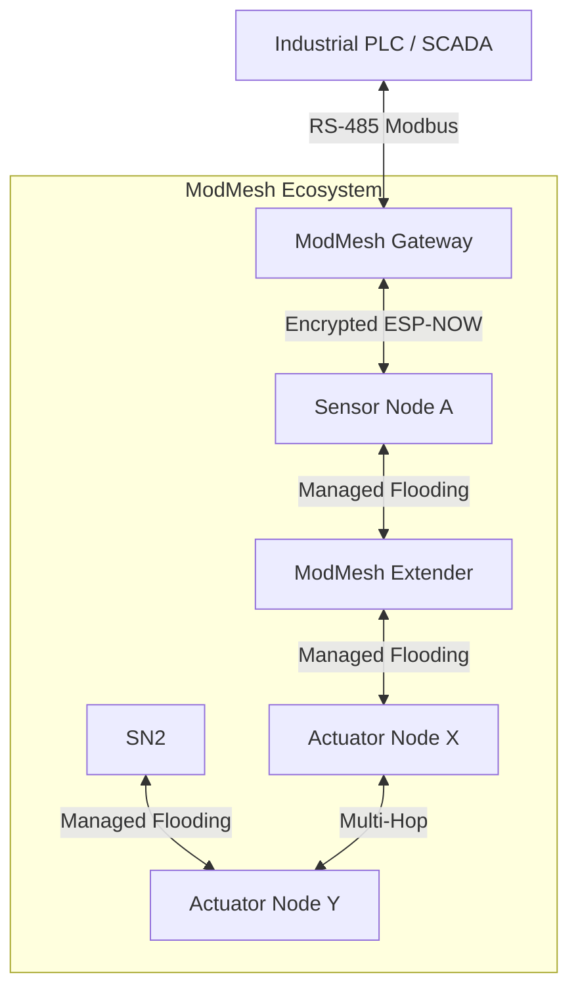

# ModMesh: Industrial-Grade ESP-NOW Flooding Mesh Ecosystem


## 📖 Introduction

**ModMesh** is a professional-grade, modular wireless mesh networking ecosystem built on the **ESP-NOW** protocol. Designed for industrial automation, remote sensing, and distributed control, it provides a high-reliability communication backbone that bypasses the limitations of traditional Wi-Fi (SSID/Connect/Disconnect overhead) and Bluetooth Mesh (complexity).

The system utilizes a **Managed Flooding** architecture, ensuring that messages propagate through the entire network with multi-hop capability, high-speed delivery, and enterprise-grade security.

---

## 🏗️ System Architecture

ModMesh utilizes a specialized **Quad-Task RTOS Model** to ensure that time-critical operations (like high-speed sensor polling or Modbus UART handling) are never delayed by background network management.

### 📊 RTOS Task Model
| Task Name | Priority | Stack Size | Responsibility |
| :--- | :---: | :---: | :--- |
| `sensor_task` | **10** (Max) | 4KB | High-speed GPIO polling (50ms) for instant responsiveness. |
| `actuator_task`| **7** | 4KB | Processes incoming command queues and triggers hardware GPIOs. |
| `modbus_task` | **6** | 4KB | Handles native Modbus RTU Slave protocol and RS-485 timing. |
| `mesh_task` | **5** | 4KB | Manages peer health, heartbeats, and background networking. |
| `device_reset` | **5** | 8KB | Monitors factory reset button (3s hold) and broadcasts safety reset. |

### 🧩 Core Component Roles
1.  **[Gateway](./Gateway)**: The central coordinator and bridge between the wireless mesh and Industrial PLCs (Modbus RTU).
2.  **[Sensor](./Sensor)**: Optimized for high-frequency data acquisition and "Change-of-State" reporting.
3.  **[Actuator](./Actuator)**: Dedicated to hardware control and semantic command execution.
4.  **[Extender](./Extender)**: A pure relay node that rebroadcasts messages to extend range without local I/O.



---

## 📡 The Mesh Engine: Managed Flooding

Unlike traditional mesh networks that require complex routing tables, ModMesh uses **Layer 2 Managed Flooding**:

### 1. Deduplication (djb2 Hash Cache)
To prevent "Broadcast Storms," where a message bounces infinitely between nodes, the system implements a deduplication cache:
- **Hashing**: Every incoming plaintext is hashed using the **djb2 algorithm** (fast, low-collision).
- **Cache**: A circular buffer stores the last **128 hashes**.
- **Logic**: If a received message's hash is already in the cache, it is dropped and not rebroadcasted.

### 2. Multi-Hop Rebroadcasting
Every node acts as a repeater. When a unique message is received, the node:
1.  Processes it locally (if keywords match).
2.  Immediately re-encrypts and rebroadcasts it to the entire network.
This ensures a message can reach a node even without direct line-of-sight to the sender.

### 3. Reliable Delivery (ACK System)
To ensure industrial reliability, ModMesh implements a custom **Application-Layer ACK**:
- **Immediate ACK**: Receivers send a `MSG_TYPE_ACK` back to the immediate sender.
- **Dynamic Timeout**: The `ACK_TIMEOUT_MS` is automatically calculated based on the network size:
  `ACK_TIMEOUT_MS = 300 + (50 * MESH_MAX_DEVICES)`
- This ensures larger networks have enough time for multi-hop propagation without triggering false failure logs.

---

## 🌐 Network Topologies

ModMesh supports various industrial deployment patterns, allowing for flexible coverage based on factory floor layouts.


1.  **Star Topology**: Centralized control where a Gateway or Extender manages a cluster of nearby sensors.
2.  **Serial (Chain) Topology**: Ideal for long corridors or production lines where nodes relay messages in a sequence.
3.  **Circle (Ring) Topology**: Provides redundant paths for critical data; if one node fails, the signal floods through the other side.
4.  **Parallel (Grid) Topology**: A high-density mesh where every node has multiple neighbors, ensuring maximum self-healing capability.

---

## 📬 Communication Protocol (Pub/Sub)

ModMesh uses a semantic **Publish/Subscribe** model. Messages are tagged with keywords in brackets to route data without hardcoded addresses.

### Message Structure
`[SENDER_LABEL | MAC | SEQ] [TOPICS] DATA`

- **SENDER_LABEL**: e.g., `SENSOR_01`.
- **MAC**: The physical Wi-Fi MAC for multi-hop tracking.
- **SEQ**: A 32-bit incrementing sequence number for replay protection.
- **TOPICS**: Keywords (e.g., `[MOTORS, LIGHTS]`). Target nodes filter by these strings.

### Routing Logic
A node triggers its actuator only if:
- Topic is `ALL` (Global Broadcast).
- Topic matches its `NODE_LABEL`.
- Topic matches any keyword in its `ACTUATOR_KEYWORDS` list.

---

## 🔐 Enterprise-Grade Security

Security is integrated into the wire protocol, not treated as an afterthought.

- **AES-128-CBC Encryption**: All application data is encrypted using `mbedTLS` hardware acceleration.
- **Random IV (Initialization Vector)**: Every single packet is prepended with a **16-byte random salt**. Even identical sensor states produce unique encrypted noise, preventing pattern analysis.
- **Replay Protection**: Global sequence numbers are embedded inside the encrypted body. The djb2 cache naturally prevents attackers from re-sending captured packets.
- **Integrity**: PKCS#7 padding validation acts as a secondary check for data corruption or unauthorized tampering.

---

## 🏭 Industrial Integration (Modbus RTU)

The Gateway node acts as a **Native Modbus RTU Slave**, allowing direct connection to PLCs like the Siemens S7-200 or S7-1200 via RS-485.

### Virtual Register Map
| Register | Address | Type | Description |
| :--- | :--- | :--- | :--- |
| **40001** | `0x0000` | Read-Only | **Remote Sensor State**: 0=Off, 1=On. |
| **40002** | `0x0001` | Read/Write | **LED Command**: Write 1 to turn ON mesh, 0 to turn OFF. |

### Data Flow Logic
1. **PLC** writes `1` to Register `40002`.
2. **Gateway** detects the change and broadcasts `[ALL]CMD:LED_ON` to the mesh.
3. **Actuator Nodes** receive the command and trigger their physical relays/outputs.

---

## 🚨 Emergency Mesh Reset & Zero-State

Safety is critical in industrial environments. ModMesh features a **Network-Wide Emergency Reset**:

1. **Trigger**: Hold the physical reset button (GPIO 1) for **3 seconds**.
2. **Warning**: The LED flashes **Rapid Red** (100ms pulse) for 3 seconds.
3. **Execution**:
   - The node broadcasts `[ALL]CMD:NETWORK_RESET`.
   - All nodes in the mesh catch this command and force their actuators into a **Safe Initial State** (Zero-State).
   - The initiating node wipes its local NVS (Peer IDs, Identity) and reboots.

---

## ⚙️ Configuration (shared_config.h)

Centralized configuration allows for rapid deployment of new nodes.

| Parameter | Default | Description |
| :--- | :--- | :--- |
| `DEVICE_ROLE` | `ROLE_GATEWAY` | Defines node behavior (Gateway, Sensor, Actuator, Both, Extender). |
| `NODE_LABEL` | `GATEWAY_01` | Unique human-readable identifier for the node. |
| `ACTUATOR_KEYWORDS`| `ALL` | Topics this node subscribes to. |
| `NETWORK_API_KEY`| `A7F9...` | 32-char hex string (128-bit AES key). |
| `MESH_MAX_DEVICES`| `25` | Maximum peers to track (used for ACK timing). |
| `MESH_KEEPALIVE_INTERVAL_MS` | `1000` | Heartbeat frequency (Peer health tracking). |
| `MAX485_UART_PORT`| `1` | UART peripheral used for industrial RS-485. |
| `MAX485_BAUD_RATE` | `9600` | Standard baud rate for industrial PLCs. |

---

## 📊 Visual Diagnostics (RGB Status LED)

ModMesh uses a smart RGB signaling system for instant hardware feedback:

| Color | Pattern | Meaning |
| :--- | :--- | :--- |
| 🟢 **Solid Green** | Static | **Healthy Mesh**: All configured peers are online. |
| 🟢 **Blinking Green**| 500ms | **Partial Mesh**: One or more nodes are offline/silent. |
| 🔴 **Solid Red** | Static | **Isolation**: No peers detected (Check power/API key). |
| 🔵 **Blue Pulse** | Pulse | **Transmission**: Active data exchange or waiting for ACK. |
| 🔴 **Rapid Red** | 100ms | **Safety Reset**: Button held; 3s until factory wipe. |

---

## 🛠️ Getting Started

### Prerequisites
- **ESP-IDF v5.x** (Native C framework).
- **Hardware**: ESP32-S3 or ESP32-C3.
- **Modbus**: MAX485 / TTL-to-RS485 module (Gateway only).

### Installation & Build
```bash
# 1. Clone the ecosystem
git clone --recursive https://github.com/dzmarkets/ModMesh.git
cd ModMesh

# 2. Configure the role
# Edit [Role]/components/shared_config/include/shared_config.h

# 3. Build and Flash (Choose a role: Gateway, Sensor, Actuator, or Extender)
cd [Role]
idf.py build flash monitor
```

---

## 📄 License & Author
Developed by **M. YOUCEF Yazid** (yazid.youcef@gmail.com)
Part of the **dzmarkets** industrial IoT ecosystem.
All rights reserved.