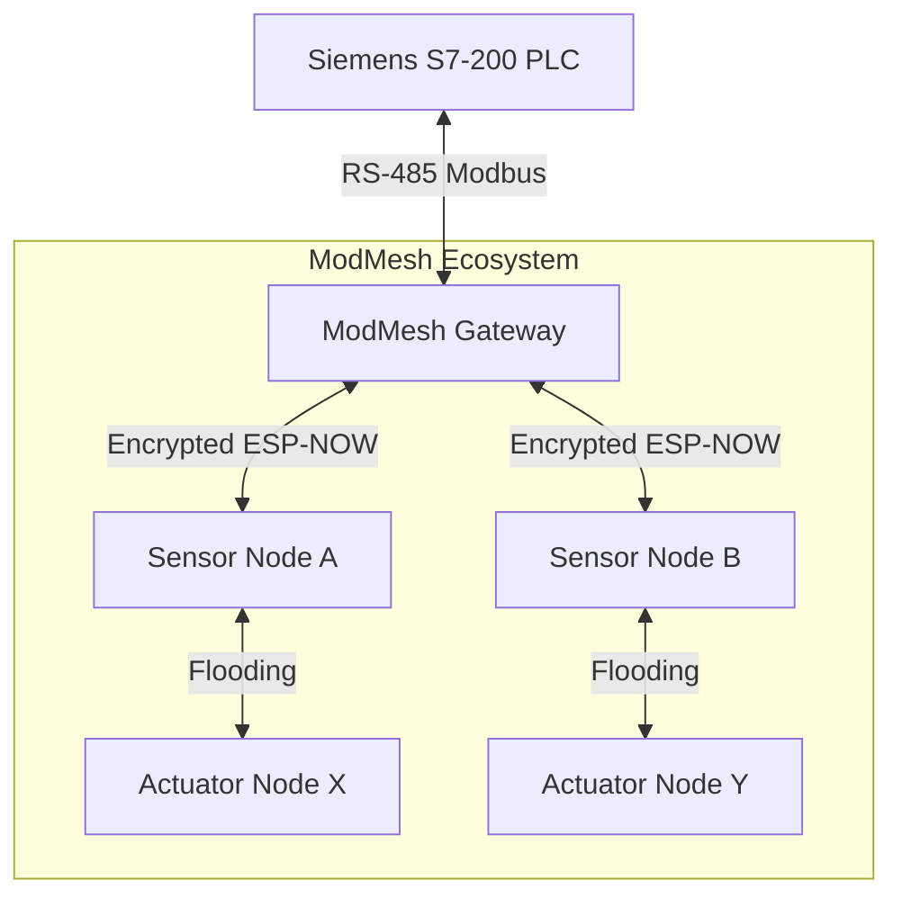

# ModMesh: Industrial-Grade ESP-NOW Flooding Mesh Ecosystem


## 📖 Introduction

**ModMesh** is a professional-grade, modular wireless mesh networking ecosystem built on top of the **ESP-NOW** protocol. Designed for industrial automation, remote sensing, and distributed control, it provides a high-reliability communication backbone that bypasses the limitations of traditional Wi-Fi (SSID/Connect/Disconnect overhead) and Bluetooth Mesh (complexity).

The system is built around a **Managed Flooding** architecture, ensuring that messages propagate through the entire network with multi-hop capability, high-speed delivery, and enterprise-grade security.

---

## 🏗️ System Architecture

ModMesh utilizes a specialized **Quad-Task RTOS Model** to ensure that time-critical operations (like high-speed sensor polling or Modbus UART handling) are never delayed by background network management.

### 🧩 Core Components
1.  **Gateway**: The central bridge between the wireless mesh and industrial PLC systems (Modbus RTU).
2.  **Sensor**: Nodes optimized for high-frequency data acquisition and reporting.
3.  **Actuator**: Nodes dedicated to hardware control and command execution.

### 📊 RTOS Task Model
| Task Name | Priority | Stack Size | Responsibility |
| :--- | :---: | :---: | :--- |
| `sensor_task` | **10** (Max) | 4KB | Polls hardware inputs every 50ms for instant responsiveness. |
| `modbus_task` | **6** | 4KB | Handles native Modbus RTU Slave protocol and RS-485 timing. |
| `mesh_task` | **5** | 4KB | Manages peer health, heartbeats, and background networking. |
| `device_reset` | **5** | 8KB | Monitors factory reset button (3s hold) and broadcasts safety reset. |
| `actuator_task`| **7** | 4KB | Processes incoming command queues and triggers GPIOs. |



---

## 📡 Networking & Logic

### 1. Managed Flooding & Multi-Hop
Unlike traditional mesh networks that require complex routing tables, ModMesh uses **Layer 2 Managed Flooding**:
- **Deduplication**: Every packet contains a unique sequence number. Nodes use a **DJB2 hash-based cache** to identify and ignore messages they have already seen or retransmitted.
- **Auto-Rebroadcast**: When a new message is received, the node immediately re-encrypts and rebroadcasts it, allowing the signal to "flood" through the network to reach distant nodes.

### 2. Reliable Delivery (ACK System)
To ensure industrial-grade reliability, ModMesh implements a custom **Application-Layer ACK**:
- The sender waits for a confirmation from any immediate neighbor.
- **Dynamic Timeout**: The `ACK_TIMEOUT_MS` is automatically calculated based on the network size:
  `ACK_TIMEOUT_MS = 300 + (50 * MESH_MAX_DEVICES)`
- This ensures that larger networks have enough time for multi-hop propagation without triggering false failure logs.

### 3. Pub/Sub Keyword Routing
ModMesh uses a semantic **Publish/Subscribe** model. Messages are tagged with keywords in brackets:
- **Format**: `[SENDER | MAC | SEQ] [TOPICS]DATA`
- **Example**: `[SENSOR_01 | ... | 42] [GATEWAY,ALL]TEMP:25.5`
- Nodes filter messages based on the `ACTUATOR_KEYWORDS` defined in their configuration.

---

## 🔐 Enterprise-Grade Security

Security is not an afterthought in ModMesh; it is integrated into the wire protocol.

- **Encryption**: All payloads are encrypted using **AES-128-CBC** via the `mbedTLS` library.
- **IV Management**: Every packet is prepended with a **16-byte random Initialization Vector (IV)** to ensure that the same plaintext results in different ciphertext every time.
- **Key Security**: Nodes share a 128-bit `NETWORK_API_KEY`. If keys don't match, decryption fails and the packet is dropped before reaching the application layer.
- **Integrity**: PKCS#7 padding validation acts as a secondary check for data corruption or unauthorized tampering.

---

## 🏭 Industrial Integration (Modbus RTU)

The Gateway node acts as a **Native Modbus RTU Slave**, allowing direct connection to PLCs like the Siemens S7-200 or S7-1200 via RS-485.

### Virtual Register Map
| Register | Name | Type | Description |
| :--- | :--- | :--- | :--- |
| **40001** | `Remote Sensor` | Read-Only | State of the wireless sensor nodes (0=Off, 1=On). |
| **40002** | `LED Command` | Read/Write | Command from PLC to Wireless Actuators (1=Turn ON, 0=OFF). |

### Data Flow
1. **PLC** writes `1` to Register `40002`.
2. **Gateway** detects the change and broadcasts `[ALL]CMD:LED_ON` to the mesh.
3. **Actuator Nodes** receive the command and turn on their physical outputs.

---

## 🚨 Emergency Mesh Reset & Zero-State

Safety is critical in industrial environments. ModMesh features a **Network-Wide Emergency Reset**:
1. **Trigger**: Hold the physical reset button (GPIO 1) for **3 seconds**.
2. **Warning**: The LED flashes **Rapid Red** for 3 seconds, allowing the user to cancel.
3. **Execution**:
   - The node broadcasts `[ALL]CMD:NETWORK_RESET`.
   - All nodes in the mesh catch this command and force their actuators into a **Safe Initial State**.
   - The initiating node wipes its local NVS (Peer IDs, Identity) and reboots.

---

## ⚙️ Configuration (shared_config.h)

Centralized configuration allows for rapid deployment of new nodes.

| Parameter | Default | Description |
| :--- | :--- | :--- |
| `DEVICE_ROLE` | `ROLE_GATEWAY` | Defines if the node is a Gateway, Sensor, or Actuator. |
| `NETWORK_API_KEY`| `A7F9...` | The 32-char hex string used for AES-128. |
| `MESH_MAX_DEVICES`| `25` | Scaling factor for network timing and memory. |
| `MESH_KEEPALIVE_INTERVAL_MS` | `1000` | Heartbeat frequency (Peer health). |
| `MAX485_UART_PORT`| `1` | UART peripheral used for industrial RS-485. |

---

## 📊 Visual Diagnostics

ModMesh uses a smart RGB signaling system for instant hardware feedback:

- **🟢 Solid Green**: Healthy Mesh (All peers online).
- **🟢 Blinking Green**: Partial Mesh (One or more nodes are silent).
- **🔴 Solid Red**: Isolated Node (No peers detected).
- **🔵 Blue Pulse**: Data Transmission (Sensor update sent).
- **🔴 Rapid Red Flash**: Factory Reset Warning (3s countdown).

---

## 🛠️ Getting Started

### Prerequisites
- ESP-IDF v5.x
- ESP32-S3 or ESP32-C3 hardware.

### Installation & Build
```bash
# Clone the ecosystem
git clone --recursive https://github.com/dzmarkets/ModMesh.git
cd ModMesh

# Choose a role (e.g., Gateway)
cd Gateway
idf.py build flash monitor
```

---

## 📄 License & Author
Developed by **M. YOUCEF Yazid** (yazid.youcef@gmail.com)
Part of the **dzmarkets** industrial IoT ecosystem.