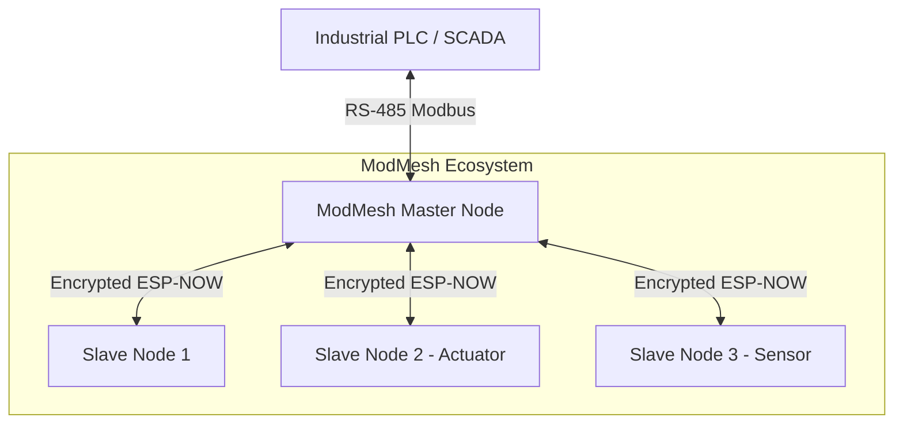

# ModMesh: Encrypted ESP-NOW Modbus RTU Bridge Ecosystem


## 📖 Introduction

**ModMesh** is an industrial-grade, ultra-low-latency wireless bridge designed to seamlessly extend physical Modbus RTU (RS-485) networks over the air using the **ESP-NOW** protocol. 
It replaces traditional hardwired RS-485 cables with a highly secure, hardware-encrypted wireless pipeline without requiring any modifications to the Master PLC's core polling mechanics.

---

## 🏗️ Dual-Core Architecture & Nodes

ModMesh utilizes a strict **Dual-Core RTOS Architecture** on the ESP32-S3 to ensure that real-time industrial Modbus timing (UART) is perfectly isolated from wireless networking jitter.

### Core Component Roles
1. **[MasterNode](./MasterNode)**: The central bridge connected directly to the Industrial PLC (via MAX485). It routes Modbus queries to the correct Slave Nodes over the air.
2. **[SlaveNode1](./SlaveNode1)**: General purpose node/hybrid.
3. **[SlaveNode2](./SlaveNode2)**: **Virtual Actuator** that receives Modbus writes (FC 05/06/16) to toggle hardware GPIOs (e.g., Relays/LEDs).
4. **[SlaveNode3](./SlaveNode3)**: **Virtual Sensor** that reads hardware inputs (e.g., Push Buttons on GPIO 2) and reports state back to the PLC via Modbus reads (FC 01/03).



---

## 📡 Core Technologies

### 1. Transparent & Virtual Routing
The Master Node parses native Modbus RTU frames entirely in software. When it receives a request for a specific Slave ID, it instantly routes it to the corresponding physical MAC address of the Slave Node.

### 2. Instant Offline Bypassing
If a Slave Node is offline or out of range, the Master Node synthesizes an immediate **Modbus Exception 0x0B** (Gateway Target Device Failed to Respond). This prevents the PLC from experiencing 1000ms timeout delays, ensuring the Modbus polling loop continues at blazing speeds.

### 3. Hardware-Accelerated Security
- **AES-128 Encryption**: All over-the-air ESP-NOW frames are encrypted using the ESP32-S3's hardware Wi-Fi cryptographic engine.
- **Strict MAC Whitelisting**: Devices explicitly bind to hardcoded peer MAC addresses (`shared_config.h`). Unregistered devices attempting to spoof the network are silently dropped at the MAC layer.

---

## 🏭 Industrial Integration (Modbus RTU)

ModMesh seamlessly integrates with PLCs like the Siemens S7-200.

### Virtual Register Mapping Example
| Target | Address | Type | Description |
| :--- | :--- | :--- | :--- |
| **Slave ID 3** | `40001` | Read | **Virtual Sensor**: Reads the push-button toggle state from SlaveNode3 (GPIO 2). |
| **Slave ID 2** | `40002` | Write | **Virtual Actuator**: Writes a state to trigger the LED/Relay on SlaveNode2 (GPIO 14). |

### PLC Timer State Machine
To prevent RS-485 bus collisions and Modbus "Error 6 (Busy)" states, the Master PLC must poll the nodes sequentially using a robust Timer State Machine:
1. Poll Slave 3.
2. 100ms Delay.
3. Poll Slave 2.
4. 100ms Delay.
*(See `MasterNode/S7_200_MasterNode.awl` for the complete, ready-to-import MicroWin STL implementation).*

---

## 🚨 Network-Wide Factory Reset & Zero-State

Safety and ease of maintenance are critical. ModMesh features a dual-tier hardware-triggered reset mechanism via the physical Smart Reset Button (GPIO 1):

1. **Local Factory Reset** (Any Node):
   - **Trigger**: Hold the reset button for $\ge$ **3 seconds**.
   - **Execution**: Blinks Red rapidly for 3 seconds, erases the NVS flash partition, and reboots.

2. **Network-Wide Factory Reset** (Master Node):
   - **Trigger**: Hold the reset button on the **Master Node** for $\ge$ **6 seconds**.
   - **Execution**: The Master Node broadcasts a secure, encrypted `REMOTE_RESET_SIGNATURE` to all Slaves. The entire network synchronizes a Rapid Red/White Strobe warning and simultaneously erases their NVS partitions.

---

## ⚙️ Configuration (`shared_config.h`)

All nodes share a unified configuration architecture (`components/shared_config/include/shared_config.h`):

```cpp
#define ESPNOW_WIFI_CHANNEL 1                  // Low-latency pinned Wi-Fi channel
#define MODBUS_BAUD_RATE    9600               // Industrial standard baud rate

// Peer Hardware MAC Whitelist
static const uint8_t MASTER_NODE_MAC[6]  = {0x94, 0xA9, 0x90, 0x19, 0x6A, 0x1C};
static const uint8_t SLAVE_NODE_1_MAC[6] = {0xAC, 0xA7, 0x04, 0xF4, 0x03, 0xEC};
static const uint8_t SLAVE_NODE_2_MAC[6] = {0xAC, 0xA7, 0x04, 0xF3, 0xFD, 0x54};
static const uint8_t SLAVE_NODE_3_MAC[6] = {0xAC, 0xA7, 0x04, 0x15, 0xBC, 0xC0};
```

---

## 📊 Visual Diagnostics (WS2812 RGB LED)

ModMesh uses a sub-50ms WS2812 NeoPixel system for instant hardware feedback:

| Color | State | Meaning |
| :---: | :--- | :--- |
| 🟢 | **Dim Solid Green** | Node is healthy, idle, and listening. |
| 🔴 | **Solid Red** | System failure (Wi-Fi, UART, or NVS init error). |
| 🌐 | **Quick Cyan Flash** | Modbus/ESP-NOW packet Received (RX). |
| 🟡 | **Quick Yellow Flash**| Modbus/ESP-NOW packet Transmitted (TX). |
| 🔴🔴 | **10Hz Red/Off Blink**| Local NVS Wipe in progress. |
| 🔴⚪ | **Red/White Strobe** | Network-Wide NVS Wipe in progress. |

---

## 🛠️ Getting Started

### Prerequisites
- **ESP-IDF v5.x** or v6.x (Native C/C++ framework).
- **Hardware**: ESP32-S3 DevKits.
- **Modbus**: MAX485 / TTL-to-RS485 module (Connected to MasterNode).

### Build & Flash
Navigate to the desired node directory and build using the ESP-IDF toolchain:
```bash
cd MasterNode
idf.py build flash monitor
```

---

## 📄 License & Author

**© 2026 M. YOUCEF Yazid. All rights reserved.**

Developed by **M. YOUCEF Yazid** (yazid.youcef@gmail.com)  

**Ecosystem & Portfolio Domains:**
- **[dz-markets.com](https://dz-markets.com)**: Full commercial platform
- **[beinsmart.cloud](https://beinsmart.cloud)**: Industrial IoT ecosystem
- **[dentiefy.com](https://dentiefy.com)**: Full platform for dental clinics, labs, and suppliers
- **[lescours.net](https://lescours.net)**: Educational platform

### Usage License
This project is copyrighted and provided under a **Custom Permissive License** with the following conditions:

- **Free for Open Source & Free Projects**: You are free to use, copy, modify, and distribute this software for any open-source, educational, or free-to-use projects.
- **Attribution Required**: You must prominently cite the original author (**M. YOUCEF Yazid**) and include a direct link back to this repository (`https://github.com/dzmarkets/ModMesh`) in your project's documentation or credits.
- **Commercial Use Restricted**: For commercial use, integration into paid products, or proprietary closed-source development, please contact the author to obtain a commercial license.