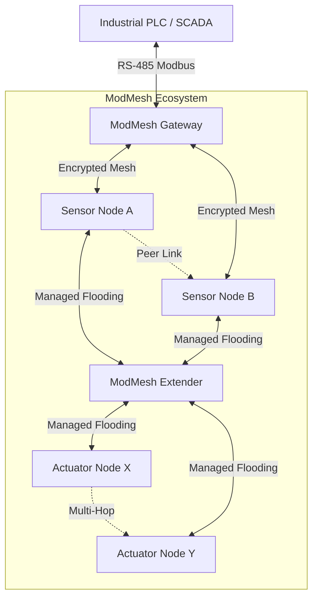
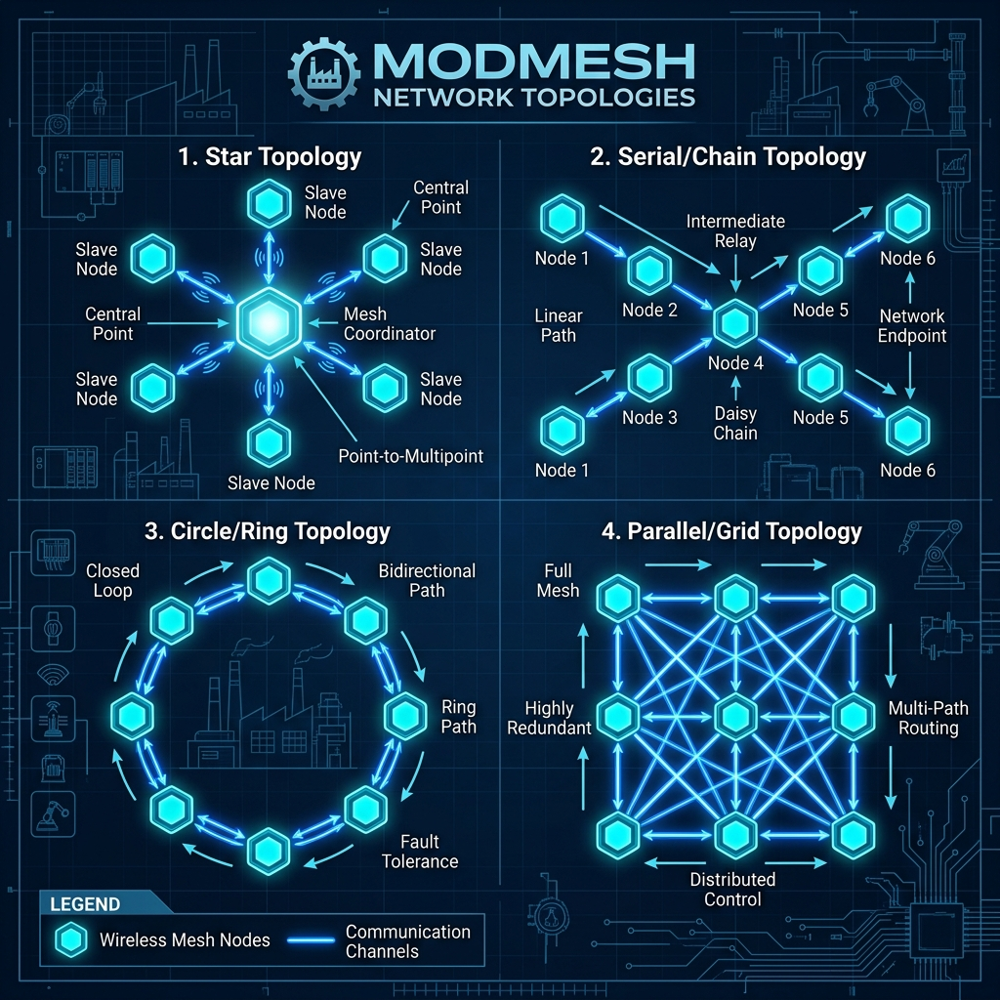

# ModMesh: Industrial-Grade ESP-NOW Flooding Mesh Ecosystem


## 📖 Introduction

**ModMesh** is a professional-grade, modular wireless mesh networking ecosystem built on the **ESP-NOW** protocol. Designed for industrial automation, remote sensing, and distributed control, it provides a high-reliability communication backbone that bypasses the limitations of traditional Wi-Fi (SSID/Connect/Disconnect overhead) and Bluetooth Mesh (complexity).

The system utilizes a **Managed Flooding** architecture, ensuring that messages propagate through the entire network with multi-hop capability, high-speed delivery, and enterprise-grade security.

---

## 🏗️ System Architecture

ModMesh utilizes a specialized **Quad-Task RTOS Model** to ensure that time-critical operations (like high-speed sensor polling or Modbus UART handling) are never delayed by background network management.

### 📊 RTOS Task Model
| Task Name | Priority | Stack Size | Responsibility |
| :--- | :---: | :---: | :--- |
| `sensor_task` | **10** (Max) | 4KB | High-speed GPIO polling (50ms) for instant responsiveness. |
| `actuator_task`| **7** | 4KB | Processes incoming command queues and triggers hardware GPIOs. |
| `modbus_task` | **6** | 4KB | Handles native Modbus RTU Slave protocol and RS-485 timing. |
| `mesh_task` | **5** | 4KB | Manages peer health, heartbeats, and background networking. |
| `device_reset` | **5** | 8KB | Monitors factory reset button (3s hold) and broadcasts safety reset. |

### 🧩 Core Component Roles
1.  **[Gateway](./Gateway)**: The central coordinator and bridge between the wireless mesh and Industrial PLCs (Modbus RTU).
2.  **[Sensor](./Sensor)**: Optimized for high-frequency data acquisition and "Change-of-State" reporting.
3.  **[Actuator](./Actuator)**: Dedicated to hardware control and semantic command execution.
4.  **[Extender](./Extender)**: A pure relay node that rebroadcasts messages to extend range without local I/O.



---

## 📡 The Mesh Engine: Managed Flooding

Unlike traditional mesh networks that require complex routing tables, ModMesh uses **Layer 2 Managed Flooding**:

### 1. Deduplication (djb2 Hash Cache)
To prevent "Broadcast Storms," where a message bounces infinitely between nodes, the system implements a deduplication cache:
- **Hashing**: Every incoming plaintext is hashed using the **djb2 algorithm** (fast, low-collision).
- **Cache**: A circular buffer stores the last **128 hashes**.
- **Logic**: If a received message's hash is already in the cache, it is dropped and not rebroadcasted.

### 2. Multi-Hop Rebroadcasting
Every node acts as a repeater. When a unique message is received, the node:
1.  Processes it locally (if keywords match).
2.  Immediately re-encrypts and rebroadcasts it to the entire network.
This ensures a message can reach a node even without direct line-of-sight to the sender.

### 3. Reliable Delivery (ACK System)
To ensure industrial reliability, ModMesh implements a custom **Application-Layer ACK**:
- **Immediate ACK**: Receivers send a `MSG_TYPE_ACK` back to the immediate sender.
- **Dynamic Timeout**: The `ACK_TIMEOUT_MS` is automatically calculated based on the network size:
  `ACK_TIMEOUT_MS = 300 + (50 * MESH_MAX_DEVICES)`
- This ensures larger networks have enough time for multi-hop propagation without triggering false failure logs.

---

## 🌐 Network Topologies

ModMesh supports various industrial deployment patterns, allowing for flexible coverage based on factory floor layouts.



1.  **Star Topology**: Centralized control where a Gateway or Extender manages a cluster of nearby sensors.
2.  **Serial (Chain) Topology**: Ideal for long corridors or production lines where nodes relay messages in a sequence.
3.  **Circle (Ring) Topology**: Provides redundant paths for critical data; if one node fails, the signal floods through the other side.
4.  **Parallel (Grid) Topology**: A high-density mesh where every node has multiple neighbors, ensuring maximum self-healing capability.

---

## 📬 Communication Protocol (Pub/Sub)

ModMesh uses a semantic **Publish/Subscribe** model. Messages are tagged with keywords in brackets to route data without hardcoded addresses.

### Message Structure
`[SENDER_LABEL | MAC | SEQ] [TOPICS] DATA`

- **SENDER_LABEL**: e.g., `SENSOR_01`.
- **MAC**: The physical Wi-Fi MAC for multi-hop tracking.
- **SEQ**: A 32-bit incrementing sequence number for replay protection.
- **TOPICS**: Keywords (e.g., `[MOTORS, LIGHTS]`). Target nodes filter by these strings.

### Routing Logic
A node triggers its actuator only if:
- Topic is `ALL` (Global Broadcast).
- Topic matches its `NODE_LABEL`.
- Topic matches any keyword in its `ACTUATOR_KEYWORDS` list.

---

## 🔐 Enterprise-Grade Security

Security is integrated into the wire protocol, not treated as an afterthought.

- **AES-128-CBC Encryption**: All application data is encrypted using `mbedTLS` hardware acceleration.
- **Random IV (Initialization Vector)**: Every single packet is prepended with a **16-byte random salt**. Even identical sensor states produce unique encrypted noise, preventing pattern analysis.
- **Replay Protection**: Global sequence numbers are embedded inside the encrypted body. The djb2 cache naturally prevents attackers from re-sending captured packets.
- **Integrity**: PKCS#7 padding validation acts as a secondary check for data corruption or unauthorized tampering.

---

## 🏭 Industrial Integration (Modbus RTU)

The Gateway node acts as a **Native Modbus RTU Slave** (Address 1), allowing direct connection to PLCs like the Siemens S7-200 (CPU 224XP) or S7-1200 via RS-485 using a MAX485 module.

### Why Modbus RTU?
Modbus RTU is utilized because it is the industry standard for serial communication. It offers:
1. **Standardization**: It acts as a "Universal Language," allowing the ESP32 gateway to communicate with almost any PLC globally (Siemens, Schneider, Delta, Mitsubishi).
2. **Simplicity**: Its straightforward request-response model is easily implemented in both PLC Ladder Logic and ESP32 C++.
3. **Efficiency**: Requires minimal overhead, ideal for legacy PLCs while maintaining data integrity through CRC checks.

### Virtual Register Map
| Register | Address | Type | Description |
| :--- | :--- | :--- | :--- |
| **40001** | `0x0000` | Read-Only | **Remote Sensor State**: 0=Off, 1=On. Mirrors wireless sensor states to the PLC (e.g., VW100). |
| **40002** | `0x0001` | Read/Write | **LED Command**: Write 1 to turn ON mesh, 0 to turn OFF. Mirrors PLC button states (e.g., VW102) to the wireless mesh. |

### Bidirectional Data Flow Logic

#### Scenario A: Remote Sensor -> Local PLC Bulb
1. **Wireless Event**: A button is pressed on a Remote ESP32, broadcasting `MSG:BTN_1:1`.
2. **Gateway Receipt**: The Gateway receives the packet and writes `1` to its internal Modbus Register `40001`.
3. **Polling Cycle**: The PLC (Master) requests Register `40001` from the Gateway (Slave 1).
4. **Data Transfer**: Gateway replies with the data (e.g., `01 03 02 00 01 79 84`).
5. **PLC Action**: The PLC stores `1` in internal memory `VW100`. The logic `VW100 == 1` activates the physical bulb (`Q0.0`).

#### Scenario B: Local PLC Button -> Remote Wireless LED
1. **Local Event**: A PLC physical button (`I0.0`) is pressed.
2. **Logic Update**: The PLC updates its local memory `VW102` to `1`.
3. **Push Cycle**: The PLC sends a Write command to the Gateway to set Register `40002` to `1`.
4. **Gateway Trigger**: The Gateway detects the change in `40002` and broadcasts `CMD:LED:1` over the mesh.
5. **Remote Action**: Actuator Nodes receive the command and trigger their physical LEDs/relays.

### Communication "Heartbeat" (T37 Timer Logic)
To prevent the PLC from "flooding" the RS-485 bus, a specific timing logic is implemented using the S7-200's **Self-Resetting Pulse Generator (Timer T37)**. Modbus is a Half-Duplex protocol, meaning only one device can transmit at a time.

- **Preventing Bus Crashes**: The PLC scans its logic every 1-5ms. Without a timer, it would attempt 500 Modbus requests per second, crashing the RS-485 bus as the Gateway wouldn't have time to respond.
- **The "Sweet Spot"**: Timer T37 is set with `PT: 5` (500ms). This limits communication to twice per second, providing responsive feedback without hardware overload.
- **Rising Edge Trigger**: The `MBUS_MSG` instruction requires a `0` to `1` transition. The T37 timer uses a Normally Closed (NC) contact to create an automatic "flicker"—a "High" signal for exactly one scan cycle every 500ms—ensuring the Modbus block executes reliably.

---

## 🚨 Network-Wide Factory Reset & Zero-State

Safety and ease of maintenance are critical in industrial environments. ModMesh features a dual-tier hardware-triggered reset mechanism via the physical reset button (GPIO 1):

1. **Local Factory Reset** (Any Node):
   - **Trigger**: Hold the physical reset button (GPIO 1) for $\ge$ **3 seconds** but less than 6 seconds, then release.
   - **Warning Cues**: LED turns **Solid Orange** at 1s, then changes to **Rapid Red** (100ms pulse) at 3s.
   - **Execution**: The node enters a **3-second rapid Red/Off blinking sequence** (50ms Red / 50ms Off) to let the user know the resetting process has started, then erases its NVS partition and reboots.

2. **Network-Wide Factory Reset** (Master Node):
   - **Trigger**: Hold the physical reset button (GPIO 1) on the **Master Node** for $\ge$ **6 seconds**, then release.
   - **Warning Cues**: LED transitions from Orange (1s) to Red (3s) and then enters a **Rapid Red/White Strobe** (50ms pulse) at 6s.
   - **Execution**:
     - The Master Node immediately broadcasts a secure 8-byte magic reset command `[0xDE, 0xAD, 0xBE, 0xEF, 0xFA, 0xCE, 0x00, 0x01]` over the hardware-encrypted ESP-NOW channel to both Slaves.
     - Both Master and Slave nodes immediately enter a synchronized **3-second rapid Red/Off blinking sequence** (50ms Red / 50ms Off) to clearly signal that the network-wide factory reset process is underway.
     - After the 3-second blinking phase, all nodes erase their NVS partitions and reboot.

---

## ⚙️ Configuration (shared_config.h)

Centralized configuration allows for rapid deployment of new nodes.

| Parameter | Default | Description |
| :--- | :--- | :--- |
| `DEVICE_ROLE` | `ROLE_GATEWAY` | Defines node behavior (Gateway, Sensor, Actuator, Both, Extender). |
| `NODE_LABEL` | `GATEWAY_01` | Unique human-readable identifier for the node. |
| `ACTUATOR_KEYWORDS`| `ALL` | Topics this node subscribes to. |
| `NETWORK_API_KEY`| `A7F9...` | 32-char hex string (128-bit AES key). |
| `MESH_MAX_DEVICES`| `25` | Maximum peers to track (used for ACK timing). |
| `MESH_KEEPALIVE_INTERVAL_MS` | `1000` | Heartbeat frequency (Peer health tracking). |
| `MAX485_UART_PORT`| `1` | UART peripheral used for industrial RS-485. |
| `MAX485_BAUD_RATE` | `9600` | Standard baud rate for industrial PLCs. |
| `REMOTE_RESET_SIGNATURE`| `0xDE...` | 8-byte signature to trigger remote factory reset. |

---

## 📊 Visual Diagnostics (RGB Status LED)

ModMesh uses a smart RGB signaling system for instant hardware feedback:

| Color | Pattern | Meaning |
| :--- | :--- | :--- |
| 🟢 **Solid Green** | Static | **Healthy Mesh**: All configured peers are online. |
| 🟢 **Blinking Green**| 500ms | **Partial Mesh**: One or more nodes are offline/silent. |
| 🔴 **Solid Red** | Static | **Isolation / Error**: No peers detected, or executing reset. |
| 🔵 **Blue Pulse** | Pulse | **Transmission**: Active data exchange or waiting for ACK. |
| 🟠 **Solid Orange** | Static | **Warning State**: Reset button held for $\ge$ 1s. |
| 🔴 **Rapid Red** | 100ms pulse | **Local Reset Pending**: Reset button held for $\ge$ 3s. |
| 🔴⚪ **Red/White Strobe**| 50ms strobe | **Network Reset Pending**: Master Node reset button held for $\ge$ 6s. |

---

## 🛠️ Getting Started

### Prerequisites
- **ESP-IDF v5.x** (Native C framework).
- **Hardware**: ESP32-S3 or ESP32-C3.
- **Modbus**: MAX485 / TTL-to-RS485 module (Gateway only).

### Installation & Build
```bash
# 1. Clone the ecosystem
git clone --recursive https://github.com/dzmarkets/ModMesh.git
cd ModMesh

# 2. Initialize and update submodules (critical for Gateway/Sensor/Actuator components)
git submodule update --init --recursive

# 3. Configure the role
# Edit [Role]/components/shared_config/include/shared_config.h

# 4. Build and Flash (Choose a role: Gateway, Sensor, Actuator, or Extender)
cd [Role]
idf.py build flash monitor
```

---

## 📄 License & Author

**© 2026 M. YOUCEF Yazid. All rights reserved.**

Developed by **M. YOUCEF Yazid** (yazid.youcef@gmail.com)  

**Ecosystem & Portfolio Domains:**
- **[dz-markets.com](https://dz-markets.com)**: Full commercial platform
- **[beinsmart.cloud](https://beinsmart.cloud)**: Industrial IoT ecosystem
- **[dentiefy.com](https://dentiefy.com)**: Full platform for dental clinics, labs, and suppliers
- **[lescours.net](https://lescours.net)**: Educational platform

### Usage License
This project is copyrighted and provided under a **Custom Permissive License** with the following conditions:

- **Free for Open Source & Free Projects**: You are free to use, copy, modify, and distribute this software for any open-source, educational, or free-to-use projects.
- **Attribution Required**: You must prominently cite the original author (**M. YOUCEF Yazid**) and include a direct link back to this repository (`https://github.com/dzmarkets/ModMesh`) in your project's documentation or credits.
- **Commercial Use Restricted**: For commercial use, integration into paid products, or proprietary closed-source development, please contact the author to obtain a commercial license.