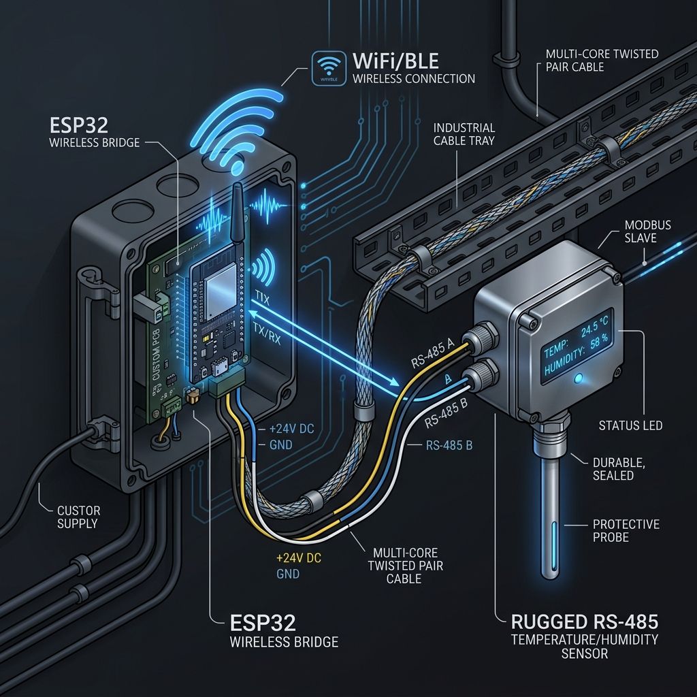
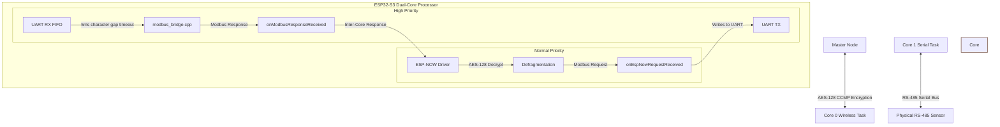
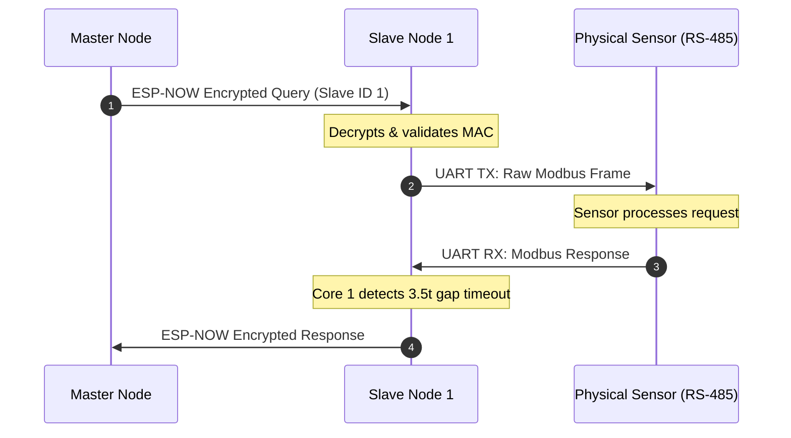

# ModMesh: Encrypted Modbus RTU Slave Node 1


## 📌 1. Introduction & Industrial Use Case

The **ModMesh Slave Node 1** operates as a high-performance wireless bridge in the ModMesh ecosystem. It is an **Encrypted Modbus RTU Slave Router** that acts as the Modbus Master to physical RS-485 sensors (such as temp/humidity sensors, meters, etc.) and routes requests back and forth to the **Master Node** over the air using the **ESP-NOW** protocol.

In a typical industrial setting, instead of running thousands of feet of RS-485 cabling to a remote sensor, you connect the sensor directly to **Slave Node 1**. It remains in standby, listening for encrypted wireless queries specifically targeted at **Slave ID 1**, and bridges them to the physical sensor transparently.

---

## 🏗️ 2. Industrial Dual-Core Architecture



To ensure strict Modbus timing and prevent wireless networking jitter from causing timeouts on the physical sensor bus, the Slave Node uses a strictly isolated dual-core architecture:



### 📊 Thread & Core Allocation

| Core | Component / Task | RTOS Priority | Responsibility |
| :---: | :--- | :---: | :--- |
| **Core 1** | `modbus_bridge` | **10 (High)** | **Real-Time RS-485 UART**. Communicates directly with the physical sensor. Transmits queries and polls the UART FIFO with a strict **5ms gap timeout** to frame responses. |
| **Core 0** | `espnow_control` | **5 (Normal)** | **Encrypted Wireless Pipeline**. Receives encrypted queries from the Master Node over ESP-NOW, and immediately routes the sensor's response back over the air. |

---

## 🏭 3. Modbus RTU Slave Router Logic

Unlike the Master Node which receives requests from a PLC, the Slave Node is in standby waiting for wireless queries.



---

## 🔐 4. Wireless Security & Custom Fragmentation

The Slave Node acts as a secure wireless terminus for the industrial network:

- **Hardware-Level AES-128 Encryption**: All over-the-air ESP-NOW frames are encrypted using the ESP32-S3's hardware Wi-Fi cryptographic engine (`PMK` and `LMK`).
- **Protected Peer Whitelisting**: The Slave Node explicitly binds to `MASTER_NODE_MAC`. Unregistered or un-encrypted devices attempting to spoof the network are silently dropped by the MAC layer.
- **Custom Packet Fragmentation**: Reassembles fragmented payloads $> 250$ bytes received over the air to support large Modbus block reads/writes.

---

## 🔌 5. Hardware Setup & Pinout Configurations

The Slave Node is built on the **ESP32-S3 DevKit** platform.

```
       ┌────────────────────────────────────────────────────────┐
       │                       ESP32-S3                         │
       │                                                        │
       │  [GPIO 17] ──────► [DI]   MAX485   [A] ───► RS-485 (A)  │
       │  [GPIO 18] ◄────── [RO]   MODULE   [B] ───► RS-485 (B)  │
       │                           (Auto-Dir)                   │
       │                                                        │
       │  [GPIO  1] ◄────── [Smart Reset Button] ──────► GND    │
       │  [GPIO 48] ──────► [WS2812 DIN (RGB LED)]               │
       └────────────────────────────────────────────────────────┘
```

### Pin Assignment Tables

| Pin Function | GPIO | ESP32-S3 Pin | Connection on MAX485 / Device |
| :--- | :---: | :---: | :--- |
| **MAX485 DI (TX)** | **GPIO 17** | Pin 17 | Driver Input (DI) |
| **MAX485 RO (RX)** | **GPIO 18** | Pin 18 | Receiver Output (RO) |
| **MAX485 RE/DE** | **N/A** | - | Not connected (Auto-Direction Module) |
| **Smart Reset Button** | **GPIO 1** | Pin 1 | Momentary Button connected to GND (Active Low) |
| **WS2812 DIN** | **GPIO 48**| Pin 48 | WS2812B NeoPixel Data Input (DIN) |

### Smart Reset & pre-Wipe Blinking Logic
- **Short Press (< 1s)**: Triggers a clean soft reboot (**Blue** flash).
- **Double Click**: Prints detailed runtime statistics to Serial (**Purple** flash).
- **Hold $\ge$ 3s (Local Reset)**: Blinks **Red/Off at 10Hz for 3 seconds** before wiping the NVS flash.
- **Remote Reset**: If the Master Node triggers a network-wide wipe, the Slave Node will receive the secure signature, blink rapidly, and erase itself.

---

## 🚦 6. Color Spectrum Visual Feedback (WS2812 NeoPixel)

The Slave Node incorporates a WS2812 NeoPixel to provide sub-50ms visual tracking:

| Color | Mode / Pattern | State Name | Meaning |
| :---: | :--- | :--- | :--- |
| 🟢 | **Dim Solid Green** | `LED_STATE_IDLE` | Node is healthy, idle, and listening. |
| 🔴 | **Solid Red** | `LED_STATE_ERROR` | System failure (Wi-Fi, UART, or NVS init error). |
| 🌐 | **Quick Cyan Flash** | `LED_STATE_ESPNOW_RX` | Encrypted query received from Master Node. |
| ⚪ | **Quick White Flash** | `LED_STATE_MODBUS_TX` | Modbus query routed to Physical Sensor. |
| 🔵 | **Quick Blue Flash** | `LED_STATE_MODBUS_RX` | Modbus response received from Physical Sensor. |
| 🟡 | **Quick Yellow Flash** | `LED_STATE_ESPNOW_TX` | Encrypted response beamed back to Master Node. |
| 🔴🔴 | **10Hz Red/Off Blink** | Pre-Wipe Warning | Wiping NVS Flash in progress (lasts 3 seconds). |

---

## ⚙️ 7. Configuration (`shared_config.h`)

All core network configurations are managed centrally in `shared_config.h`:

```cpp
#define ESPNOW_WIFI_CHANNEL 1                  // Low-latency pinned Wi-Fi channel
#define MODBUS_BAUD_RATE    9600               // Industrial standard baud rate

// Peer Hardware MAC Whitelist
static const uint8_t MASTER_NODE_MAC[6]  = {0x94, 0xA9, 0x90, 0x19, 0x6A, 0x1C};
static const uint8_t SLAVE_NODE_1_MAC[6] = {0xAC, 0xA7, 0x04, 0xF4, 0x03, 0xEC};
```

---

## 🛠️ 8. Educational Log Analysis & Troubleshooting

Students can analyze the following serial logs to verify the bridge is operating flawlessly:

### Case A: Normal Operation (Successful Poll)
```log
I (1000) SlaveNode1: Slave Node 1 initialized and listening.
I (4200) SlaveNode1: Received ESP-NOW query from Master (len: 8)
I (4200) ESPNOW_RX: 01 03 00 00 00 01 84 0a                # Received Read Holding Reg from Master
I (4202) modbus_bridge: Successfully written 8 bytes to RS-485 Sensor
I (4225) SlaveNode1: Sensor response received (len: 7)
I (4225) MODBUS_RX: 01 03 02 00 01 79 84                   # Physical Sensor replied with Data
I (4228) espnow_control: Send status callback: successfully transmitted payload
I (4228) SlaveNode1: Successfully sent response back to Master Node
```

### Case B: Remote Factory Reset Initiated by Master
```log
E (6210) SlaveNode1: !!! RECEIVED CRITICAL REMOTE FACTORY RESET COMMAND !!!
E (6210) SlaveNode1: !!! FACTORY RESET PROCESS STARTED - BLINKING LED FOR 3 SECONDS !!!
# (Node blinks RED/OFF at 10Hz for 3000ms...)
E (9210) SlaveNode1: !!! WIPING NVS FLASH AND REBOOTING NOW !!!
```

---

*Developed by M. YOUCEF Yazid | v1.2.0 Slave Node 1 Production Edition*
