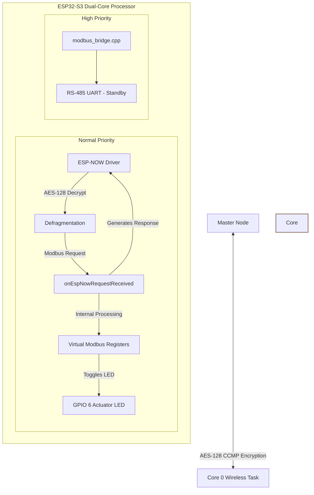
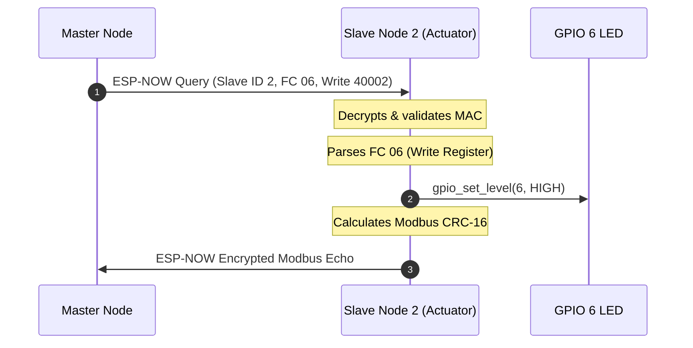

# ModMesh: Encrypted Modbus RTU Slave Node 2


## 📌 1. Introduction & Industrial Use Case

The **ModMesh Slave Node 2** operates as a hybrid wireless bridge and **Virtual Modbus Actuator** in the ModMesh ecosystem. Unlike a standard transparent bridge, Slave Node 2 intercepts incoming Modbus queries meant for **Slave ID 2** and processes them internally. 

It is configured to act as an Over-The-Air (OTA) Actuator, allowing a PLC connected to the Master Node to toggle a physical LED on the Slave Node without any RS-485 sensors attached. This demonstrates the system's ability to seamlessly integrate virtual/digital GPIO nodes directly into a traditional Modbus RTU network.

---

## 🏗️ 2. Industrial Dual-Core Architecture


To ensure strict Modbus timing and prevent wireless networking jitter, the Slave Node uses a strictly isolated dual-core architecture. For Slave Node 2, Core 0 handles the Virtual Actuator logic entirely in memory:



### 📊 Thread & Core Allocation

| Core | Component / Task | RTOS Priority | Responsibility |
| :---: | :--- | :---: | :--- |
| **Core 0** | `espnow_control` | **5 (Normal)** | **Encrypted Wireless Pipeline & Actuator**. Receives encrypted queries from the Master Node, parses Modbus function codes natively (FC 01, 03, 05, 06, 10), updates GPIO 6, and dynamically generates valid Modbus RTU responses (including CRC-16) to beam back. |
| **Core 1** | `modbus_bridge` | **10 (High)** | **Standby UART**. Initializes the RS-485 driver in case physical bridging is required in future configurations. |

---

## 🏭 3. Virtual Modbus Actuator Logic

Slave Node 2 emulates a physical Modbus device by parsing standard Modbus frames entirely in software.



### Supported Function Codes:
- **FC 01 (Read Coils) / FC 03 (Read Holding Registers)**: Returns the current state of the Actuator LED (0 or 1).
- **FC 05 (Write Coil) / FC 06 (Write Single Register)**: Turns the Actuator LED ON (>0) or OFF (0).
- **FC 10 (Write Multiple Registers)**: Supported for updating the LED state via block writes.

---

## 🔐 4. Wireless Security & Custom Fragmentation

The Slave Node acts as a secure wireless terminus for the industrial network:

- **Hardware-Level AES-128 Encryption**: All over-the-air ESP-NOW frames are encrypted using the ESP32-S3's hardware Wi-Fi cryptographic engine (`PMK` and `LMK`).
- **Protected Peer Whitelisting**: The Slave Node explicitly binds to `MASTER_NODE_MAC`. Unregistered or un-encrypted devices attempting to spoof the network are silently dropped by the MAC layer.

---

## 🔌 5. Hardware Setup & Pinout Configurations

The Slave Node is built on the **ESP32-S3 DevKit** platform.

```
       ┌────────────────────────────────────────────────────────┐
       │                       ESP32-S3                         │
       │                                                        │
       │  [GPIO  6] ──────► [Actuator LED] ───► GND             │
       │                                                        │
       │  [GPIO 17] ──────► [DI]   MAX485   [A] ───► RS-485 (A)  │
       │  [GPIO 18] ◄────── [RO]   MODULE   [B] ───► RS-485 (B)  │
       │                           (Auto-Dir)                   │
       │                                                        │
       │  [GPIO  1] ◄────── [Smart Reset Button] ──────► GND    │
       │  [GPIO 48] ──────► [WS2812 DIN (RGB LED)]               │
       └────────────────────────────────────────────────────────┘
```

### Pin Assignment Tables

| Pin Function | GPIO | ESP32-S3 Pin | Connection on Device |
| :--- | :---: | :---: | :--- |
| **Actuator LED** | **GPIO 6** | Pin 6 | Positive leg of an external LED (with resistor) to GND |
| **MAX485 DI (TX)** | **GPIO 17** | Pin 17 | Driver Input (DI) |
| **MAX485 RO (RX)** | **GPIO 18** | Pin 18 | Receiver Output (RO) |
| **Smart Reset Button** | **GPIO 1** | Pin 1 | Momentary Button connected to GND (Active Low) |
| **WS2812 DIN** | **GPIO 48**| Pin 48 | WS2812B NeoPixel Data Input (DIN) |

### Smart Reset & pre-Wipe Blinking Logic
- **Short Press (< 1s)**: Triggers a clean soft reboot (**Blue** flash).
- **Double Click**: Prints detailed runtime statistics to Serial (**Purple** flash).
- **Hold $\ge$ 3s (Local Reset)**: Blinks **Red/Off at 10Hz for 3 seconds** before wiping the NVS flash.
- **Remote Reset**: If the Master Node triggers a network-wide wipe, the Slave Node will receive the secure signature, blink rapidly, and erase itself.

---

## 🚦 6. Color Spectrum Visual Feedback (WS2812 NeoPixel)

The Slave Node incorporates a WS2812 NeoPixel to provide sub-50ms visual tracking:

| Color | Mode / Pattern | State Name | Meaning |
| :---: | :--- | :--- | :--- |
| 🟢 | **Dim Solid Green** | `LED_STATE_IDLE` | Node is healthy, idle, and listening. |
| 🔴 | **Solid Red** | `LED_STATE_ERROR` | System failure (Wi-Fi, UART, or NVS init error). |
| 🌐 | **Quick Cyan Flash** | `LED_STATE_ESPNOW_RX` | Encrypted query received from Master Node. |
| 🟡 | **Quick Yellow Flash** | `LED_STATE_ESPNOW_TX` | Encrypted, internally-generated Modbus response beamed back to Master Node. |
| 🔴🔴 | **10Hz Red/Off Blink** | Pre-Wipe Warning | Wiping NVS Flash in progress (lasts 3 seconds). |

---

## ⚙️ 7. Configuration (`shared_config.h`)

All core network configurations are managed centrally in `shared_config.h`:

```cpp
#define ESPNOW_WIFI_CHANNEL 1                  // Low-latency pinned Wi-Fi channel
#define MODBUS_BAUD_RATE    9600               // Industrial standard baud rate

// Peer Hardware MAC Whitelist
static const uint8_t MASTER_NODE_MAC[6]  = {0x94, 0xA9, 0x90, 0x19, 0x6A, 0x1C};
static const uint8_t SLAVE_NODE_2_MAC[6] = {0xAC, 0xA7, 0x04, 0xF3, 0xFD, 0x54};
```

---

## 🛠️ 8. Educational Log Analysis & Troubleshooting

Students can analyze the following serial logs to verify the Virtual Actuator is operating flawlessly:

### Case A: Write Request (FC 06) turning ON the LED
```log
I (1000) SlaveNode2: Slave Node 2 initialized as Actuator and listening.
I (55130) SlaveNode2: Received ESP-NOW query from Master (len: 8)
I (55130) ESPNOW_RX: 02 06 00 00 00 01 48 39               # Master requests Write to Reg 40002 (Value 1)
W (55135) SlaveNode2: Actuator LED [GPIO 6] set to ON       # Virtual Actuator state updated
I (55140) SlaveNode2: Sent Modbus response back to Master (len: 8)
I (55140) ESPNOW_TX: 02 06 00 00 00 01 48 39               # Proper Modbus Echo response sent
```

### Case B: Remote Factory Reset Initiated by Master
```log
E (6210) SlaveNode2: !!! RECEIVED CRITICAL REMOTE FACTORY RESET COMMAND !!!
E (6210) SlaveNode2: !!! FACTORY RESET PROCESS STARTED - BLINKING LED FOR 3 SECONDS !!!
# (Node blinks RED/OFF at 10Hz for 3000ms...)
E (9210) SlaveNode2: !!! WIPING NVS FLASH AND REBOOTING NOW !!!
```

---

*Developed by M. YOUCEF Yazid | v1.2.0 Slave Node 2 Production Edition*
